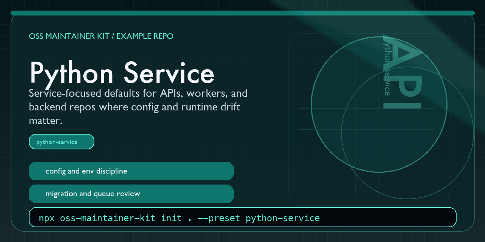

# OSS Maintainer Kit Python Service Example



This repository shows what the `python-service` preset from [oss-maintainer-kit](https://github.com/BlakeHampson/oss-maintainer-kit) looks like after scaffolding.

It was generated with:

```bash
npx oss-maintainer-kit init . \
  --repo-name oss-maintainer-kit-python-service-example \
  --maintainer "Blake Hampson" \
  --preset python-service
```

## Why this repo exists

It is a concrete example for maintainers running a Python API, worker, or backend service where configuration, migrations, runtime behavior, and deploy discipline need explicit review guidance.

## Quick scan

- `AGENTS.md`: runtime, config, migration, and observability-focused review guidance
- `docs/START_HERE.md`: the fastest orientation pass for a service maintainer
- `docs/MAINTAINER_WORKFLOW.md`: how to review runtime and deploy risk
- `docs/RUNBOOK.md`: example operational notes maintainers should keep current
- `docs/ARCHITECTURE.md`: example service-boundary notes maintainers should keep current
- `service/README.md`: example service-surface notes worth reviewing before merge

## What this preset is trying to optimize

- fewer production surprises from config or runtime drift
- clearer validation expectations for endpoint and worker changes
- deploy notes that are easy to follow when the maintainer is working alone

## Related project

- Main tool: <https://github.com/BlakeHampson/oss-maintainer-kit>
- npm package: <https://www.npmjs.com/package/oss-maintainer-kit>
